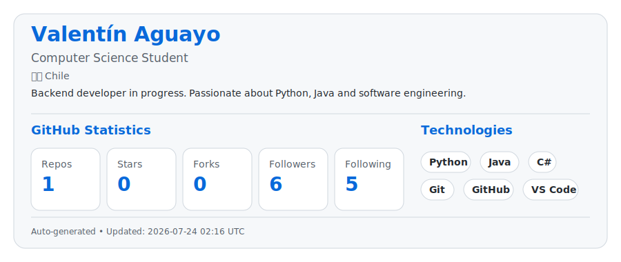

# 👋 Hola, soy **Valentín Aguayo**

### 💻 Computer Science Student

Apasionado por el desarrollo de software, backend e inteligencia artificial.

<picture>
    <source media="(prefers-color-scheme: dark)" srcset="dark_mode.svg">
    
</picture>

 

---

## 📊 GitHub

---

# 🚀 Sobre mí

- 🎓 Computer Science Student
- 🌱 Aprendiendo Java, Python y C#
- 💻 Interesado en Backend Development
- 🤖 Aprendiendo Inteligencia Artificial
- 🇨🇱 Chile

---

## 📌 Objetivos 2026

- ✅ Crear un portafolio profesional.
- 📚 Mejorar mis habilidades en Java.
- 🐍 Dominar Python.
- 🔥 Publicar proyectos en GitHub.
- 🤝 Contribuir a proyectos Open Source.

---

⭐ Gracias por visitar mi perfil ⭐

