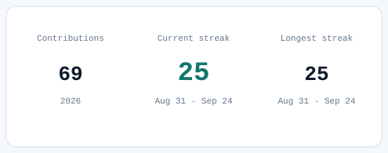

  <picture>
    <source media="(prefers-color-scheme: dark)" srcset="dark_mode.svg">
    
  </picture>

   

  <h3>Software Engineer · Systems builder · Chile</h3>

  

    I design and ship <b>APIs</b>, <b>CLIs</b>, and full-stack apps with clear architecture, 
    predictable behavior, and code that stays maintainable as it grows.
  

  

    <a href="https://github.com/ValentinAguayo1?tab=repositories">Repositories</a>
    ·
    <a href="https://github.com/ValentinAguayo1/taskflow">TaskFlow</a>
    ·
    <a href="https://github.com/ValentinAguayo1/gh-summary-cli">gh-summary-cli</a>
    ·
    <a href="mailto:valentin.aguayo6@gmail.com">Email</a>
  

---

## Currently building

TaskFlow polish (focus workflows) and deeper backend / API design practice.

---

## Featured work

| Project | What it is | Stack | Try it |
|--------:|:-----------|:------|:-------|
| **[TaskFlow](https://github.com/ValentinAguayo1/taskflow)** | Task manager built around *what should I do now?* Focus mode, drag-and-drop priority, auth, Firestore rules. | Angular · Firebase · Firestore | [Live demo](https://taskflow-878df.web.app) |
| **[gh-summary-cli](https://github.com/ValentinAguayo1/gh-summary-cli)** | Terminal toolkit for GitHub profiles: dashboards, repo health, developer comparison, Gemini summaries. | Python · Typer · Rich · httpx · Gemini | `pip install -e .` |

---

## Open to

- Internships in backend or software engineering
- Collaborations on CLIs, APIs, and full-stack apps
- Junior backend roles where clean architecture matters

**Contact:** [valentin.aguayo6@gmail.com](mailto:valentin.aguayo6@gmail.com)

---

## GitHub activity

Stats and streak from GitHub GraphQL. Rank is activity on that card, not a quality score.

  <table>
    <tr>
      <td>
        <picture>
          <source media="(prefers-color-scheme: dark)" srcset="stats_dark.svg">
          
        </picture>
      </td>
      <td>
        <picture>
          <source media="(prefers-color-scheme: dark)" srcset="streak_dark.svg">
          
        </picture>
      </td>
    </tr>
  </table>

---

## Tech

`Python` · `TypeScript` · `Angular` · `Java` · `C#` · `SQL` · `Firebase` · `GitHub Actions`
